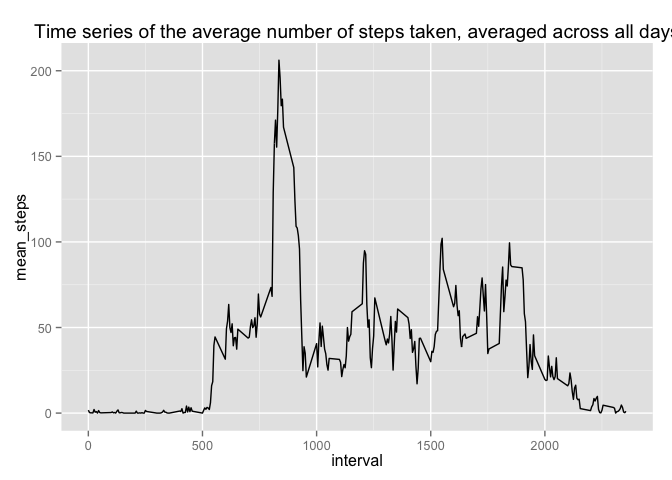
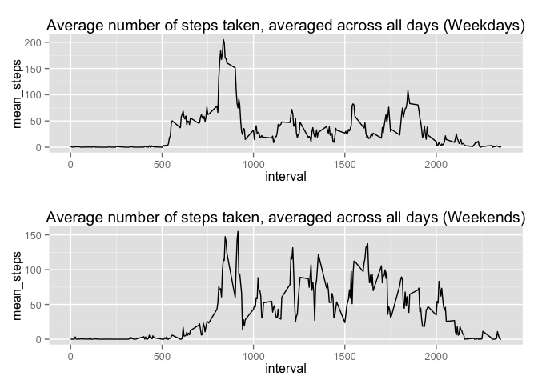

# Reproducible Research: Peer Assessment 1

## Loading and preprocessing the data


```r
#Required package
#install.packages("gridExtra") 
# Change the directory to where you repo is located at
#setwd("/Users/ogomez/Documents/Coursera/Git/RepData_PeerAssessment1")
raw_data <- read.table(unz("activity.zip", "activity.csv"), header=T, quote="\"", sep=",")
complete_raw_data <- raw_data[ complete.cases(raw_data), ]

summary(raw_data)
```

```
##      steps               date          interval   
##  Min.   :  0.0   2012-10-01:  288   Min.   :   0  
##  1st Qu.:  0.0   2012-10-02:  288   1st Qu.: 589  
##  Median :  0.0   2012-10-03:  288   Median :1178  
##  Mean   : 37.4   2012-10-04:  288   Mean   :1178  
##  3rd Qu.: 12.0   2012-10-05:  288   3rd Qu.:1766  
##  Max.   :806.0   2012-10-06:  288   Max.   :2355  
##  NA's   :2304    (Other)   :15840
```

## What is mean total number of steps taken per day?

Some data cleaning first


```r
steps_sum <- aggregate( raw_data$steps, by=list(raw_data$date), FUN=sum )
names(steps_sum) <- c("date", "steps")
```

###Histogram of the total number of steps taken each day


```r
unfilled_hist <- hist( steps_sum$steps, xlab="Total steps per day", main="Histogram of the total number of steps taken each day", breaks=12 )
```

 

###The mean and median total number of steps taken per day

***The mean***


```r
mean_raw <- mean(steps_sum[!is.na(steps_sum$steps), c("steps")]); mean_raw
```

```
## [1] 10766
```

***The median***


```r
median_raw <- median(steps_sum[!is.na(steps_sum$steps), c("steps")]); median_raw
```

```
## [1] 10765
```

## What is the average daily activity pattern?

### Preparing data


```r
# graphics packages

interval_mean <- aggregate( complete_raw_data$steps, by=list(complete_raw_data$interval), FUN=mean )
names(interval_mean) <- c("interval","mean_steps")
```

### Time series


```r
require(ggplot2)
```

```
## Loading required package: ggplot2
```

```r
# boxplot

ggplot(interval_mean, aes(x=interval, y=mean_steps)) + geom_line()+ opts(title = "Time series of the average number of steps taken, averaged across all days")
```

```
## 'opts' is deprecated. Use 'theme' instead. (Deprecated; last used in version 0.9.1)
## Setting the plot title with opts(title="...") is deprecated.
##  Use labs(title="...") or ggtitle("...") instead. (Deprecated; last used in version 0.9.1)
```

 

### Maximum number of steps


```r
interval_mean[ which.max( interval_mean[,2] ),]
```

```
##     interval mean_steps
## 104      835      206.2
```

## Imputing missing values

### Total number of missing values


```r
na_raw_data <- raw_data[is.na( raw_data$steps ),]
nrow( na_raw_data )
```

```
## [1] 2304
```

### Filling in all of the missing values in the dataset

To fill the missing values I'm gonna use the median for that interval from all days in the dataset


```r
interval_median <- aggregate( complete_raw_data$steps, by=list(complete_raw_data$interval), FUN=median )
names(interval_median) <- c("interval","steps")

# lets join
merged_data <- merge(na_raw_data,interval_median,by="interval")
names(merged_data) <- c( "interval", "nasteps", "date", "steps" )
summary(merged_data)
```

```
##     interval       nasteps             date         steps      
##  Min.   :   0   Min.   : NA    2012-10-01:288   Min.   : 0.00  
##  1st Qu.: 589   1st Qu.: NA    2012-10-08:288   1st Qu.: 0.00  
##  Median :1178   Median : NA    2012-11-01:288   Median : 0.00  
##  Mean   :1178   Mean   :NaN    2012-11-04:288   Mean   : 3.96  
##  3rd Qu.:1766   3rd Qu.: NA    2012-11-09:288   3rd Qu.: 0.00  
##  Max.   :2355   Max.   : NA    2012-11-10:288   Max.   :60.00  
##                 NA's   :2304   (Other)   :576
```

### New dataset


```r
filled_data <- rbind( raw_data[ !is.na(raw_data$steps), ], merged_data[,c("steps", "date", "interval")] )
summary(filled_data)
```

```
##      steps             date          interval   
##  Min.   :  0   2012-10-01:  288   Min.   :   0  
##  1st Qu.:  0   2012-10-02:  288   1st Qu.: 589  
##  Median :  0   2012-10-03:  288   Median :1178  
##  Mean   : 33   2012-10-04:  288   Mean   :1178  
##  3rd Qu.:  8   2012-10-05:  288   3rd Qu.:1766  
##  Max.   :806   2012-10-06:  288   Max.   :2355  
##                (Other)   :15840
```

### Histogram and conclusions


```r
filled_steps_sum <- aggregate( filled_data$steps, by=list(filled_data$date), FUN=sum )
names(filled_steps_sum) <- c("date", "steps")
filled_hist <- hist( filled_steps_sum$steps, xlab="Total steps per day", main="Histogram of the total number of steps taken each day (Filled Data)", breaks=12 )
```

 

***The mean***


```r
mean_filled <- mean(filled_steps_sum[, c("steps")]); mean_filled
```

```
## [1] 9504
```

***The median***


```r
median_filled <- median(filled_steps_sum[, c("steps")]); median_filled
```

```
## [1] 10395
```

### Impact of imputing missing data on the estimates of the total daily number of steps

* Missing values added to the first break ( 0, 2000 ) in the histogram ( 8 ocurrences more )
* Mean got reduced by 1262.3198 ( 9503.8689 vs 1.0766 &times; 10<sup>4</sup>  )
* Median got reduced by 370 ( 10395 vs 10765  )


## Are there differences in activity patterns between weekdays and weekends?

### Create a new factor variable


```r
str_weekdays_col <- weekdays( as.Date(filled_data[,"date"]) )
factor_weekdays_col <- factor( as.numeric(str_weekdays_col == "Saturday" | str_weekdays_col == "Sunday"), labels=c("weekday", "weekend"))
filled_data <- cbind( filled_data, factor_weekdays_col )
summary(factor_weekdays_col)
```

```
## weekday weekend 
##   12960    4608
```

### Panel plot 'weekday' vs 'weekend'


```r
weekday_data <- filled_data[filled_data$factor_weekdays_col == "weekday",]
weekend_data <- filled_data[filled_data$factor_weekdays_col == "weekend",]

weekday_interval_mean <- aggregate( weekday_data$steps, by=list(weekday_data$interval), FUN=mean )
weekend_interval_mean <- aggregate( weekend_data$steps, by=list(weekend_data$interval), FUN=mean )
names(weekend_interval_mean) <- c("interval","mean_steps")
names(weekday_interval_mean) <- c("interval","mean_steps")

require(gridExtra)
```

```
## Loading required package: gridExtra
## Loading required package: grid
```

```r
weekday_plot <- ggplot(weekday_interval_mean, aes(x=interval, y=mean_steps)) + geom_line() + opts(title = "Average number of steps taken, averaged across all days (Weekdays)")
```

```
## 'opts' is deprecated. Use 'theme' instead. (Deprecated; last used in version 0.9.1)
## Setting the plot title with opts(title="...") is deprecated.
##  Use labs(title="...") or ggtitle("...") instead. (Deprecated; last used in version 0.9.1)
```

```r
weekend_plot <- ggplot(weekend_interval_mean, aes(x=interval, y=mean_steps)) + geom_line() + opts(title = "Average number of steps taken, averaged across all days (Weekends)")
```

```
## 'opts' is deprecated. Use 'theme' instead. (Deprecated; last used in version 0.9.1)
## Setting the plot title with opts(title="...") is deprecated.
##  Use labs(title="...") or ggtitle("...") instead. (Deprecated; last used in version 0.9.1)
```

```r
grid.arrange(weekday_plot, weekend_plot, ncol=1)
```

 

